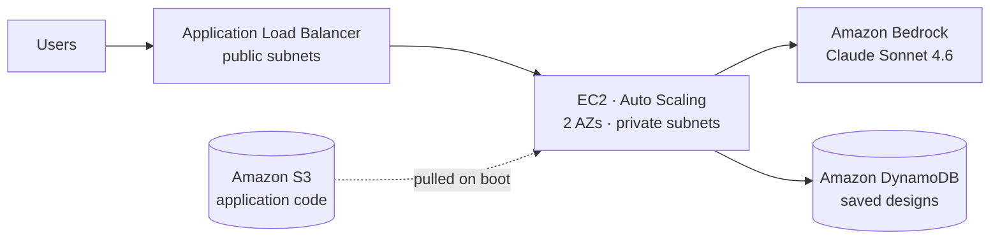

# Ask the Architect

> Describe a system in plain English, and Claude on Amazon Bedrock designs the AWS architecture to build it — running on AWS itself.

A small web app that turns a plain-English scenario ("an online shop that spikes on Black Friday") into a structured AWS architecture — rendered as a connected **request-flow diagram** plus **service cards** and Well-Architected notes. Every design is saved to DynamoDB. Built as a live-build teaching project for the [IaaS Academy](https://iaasacademy.com) **AWS Accelerator**.

---

## Architecture

A well-architected, two-tier VPC across two Availability Zones. The instances run in private subnets and reach DynamoDB and S3 over **gateway endpoints**; Bedrock is called with the instance's **IAM role**, so there are no AWS access keys anywhere.

---

## How it works

1. A user submits a scenario in the browser.
2. The Flask app on EC2 calls **Claude Sonnet 4.6** on Bedrock, asking for the design as a JSON document (title, services, request flow with branches, Well-Architected notes).
3. The design is stored in **DynamoDB** and rendered as a flow diagram + cards.
4. The **Recent designs** list reads the history back from DynamoDB.

> ⚠️ The AI output is a **first draft, not a validated design** — it can hallucinate plausible-but-wrong service choices. Always verify against the AWS docs. The model proposes; the architect disposes.

---

## Repository layout

| File | Purpose |
|---|---|
| `app.py` | Flask backend — calls Bedrock, stores designs in DynamoDB |
| `templates/index.html` | Front end — renders the flow diagram and service cards |
| `network.yaml` | CloudFormation — VPC, subnets, NAT, gateway endpoints, security groups |
| `userdata.sh` | Launch-template user data — self-configures each instance from S3 |
| `instance-policy.json` | IAM policy — Bedrock, DynamoDB and S3 access for the instance role |
| `requirements.txt` | Python dependencies |

---

## Prerequisites

- An AWS account and the AWS CLI configured (`us-east-1` recommended).
- **Bedrock model access** enabled for Claude Sonnet 4.6 (Bedrock → Model access).
- Permissions to create VPC, EC2, DynamoDB, IAM and CloudFormation resources.

## Deploy (summary)

The network is infrastructure-as-code; everything else is console-driven. Full walkthrough in **[`TUTORIAL.md`](./TUTORIAL.md)**.

1. **Network** — deploy `network.yaml` as a CloudFormation stack.
2. **Code bucket** — create an S3 bucket, upload `app.py`, `requirements.txt`, `templates/index.html` under an `app/` prefix.
3. **Bedrock** — enable Claude Sonnet 4.6, note the inference profile ID.
4. **DynamoDB** — create table `AskArchitectDesigns`, partition key `id` (String), on-demand.
5. **IAM role** — from `instance-policy.json` (+ `AmazonSSMManagedInstanceCore`).
6. **Launch template** — Amazon Linux 2023, the IAM role, `app-sg`, and `userdata.sh` as user data.
7. **ALB + target group** — internet-facing on the public subnets, health check `/healthz`.
8. **Auto Scaling group** — the two private app subnets, min/desired/max = 2.
9. Open the ALB DNS name and submit a scenario.

## Configuration

Set on each instance by `userdata.sh` (no secrets in the app):

| Variable | Default | Description |
|---|---|---|
| `AWS_REGION` | `us-east-1` | Region for Bedrock and DynamoDB |
| `BEDROCK_MODEL_ID` | `us.anthropic.claude-sonnet-4-6` | Cross-region inference profile ID |
| `DDB_TABLE` | `AskArchitectDesigns` | DynamoDB table name |

---

## Tech stack

**AWS:** VPC · Application Load Balancer · EC2 · Auto Scaling · Amazon S3 · Amazon DynamoDB · Amazon Bedrock (Claude Sonnet 4.6) · IAM · CloudFormation · Gateway Endpoints
**App:** Python · Flask · Gunicorn · boto3

## License

Released for educational use as part of the IaaS Academy AWS Accelerator. Add your own `LICENSE` file before publishing.
